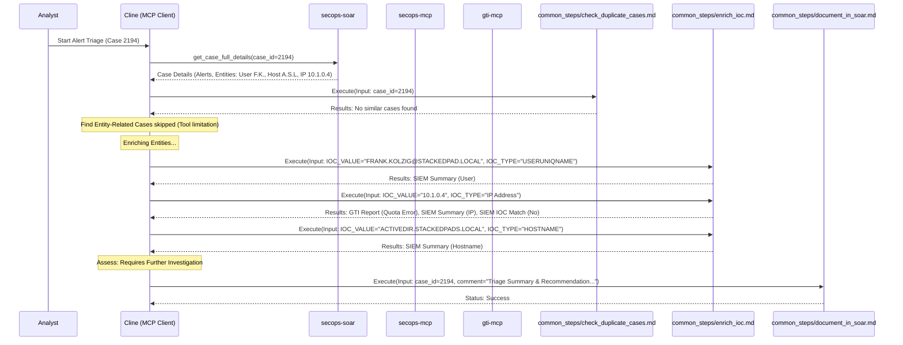

# Alert Triage Report: Case 2194

**Runbook Used:** `.clinerules/run_books/triage_alerts.md`
**Timestamp:** 2025-05-04 18:07 UTC-4
**Case ID(s):** 2194

## Summary

This report details the initial triage findings for SOAR Case 2194, which involves multiple alerts related to repeated authentication failures followed by success.

## Workflow Diagram

## Findings

*   **Alerts:** Multiple instances of `win_repeatedAuthFailure_thenSuccess_T1110_001` were associated with this case.
*   **Key Entities:**
    *   User: `FRANK.KOLZIG@STACKEDPAD.LOCAL`
    *   Hostname: `ACTIVEDIR.STACKEDPADS.LOCAL`
    *   Source IP: `10.1.0.4`
*   **Enrichment:**
    *   User `FRANK.KOLZIG@STACKEDPAD.LOCAL`: SIEM lookup showed activity up to 2025-05-03, but no specific alerts/events in the 24h summary.
    *   IP `10.1.0.4`: Appears internal, no recent activity/alerts/IOC matches in the 24h SIEM lookup. GTI enrichment failed due to API quota limits.
    *   Hostname `ACTIVEDIR.STACKEDPADS.LOCAL`: SIEM lookup showed activity up to 2025-05-03, but no specific alerts/events in the 24h summary.
*   **Duplicate Check:** No similar cases were found based on the rule generator (`win_repeatedAuthFailure_thenSuccess_T1110_001_graph_override`).
*   **Related Cases:** Searching for related cases based on entities was not possible with the available tools.

## Assessment

The alerts indicate potential brute-forcing activity (T1110.001) involving an internal user, host, and IP address. While initial enrichment did not reveal external threats or corroborating malicious activity within the limited scope checked, the nature of the alert itself warrants further investigation. The GTI quota limit prevented a full reputation check on the source IP.

## Recommendation

Escalate to Tier 2 for detailed analysis of the specific authentication logs (e.g., Windows Event Logs 4624, 4625) for user `FRANK.KOLZIG@STACKEDPAD.LOCAL` on host `ACTIVEDIR.STACKEDPADS.LOCAL` around the alert timestamps (approximately 2025-04-30 13:27 UTC to 14:33 UTC) to determine the legitimacy of the failed and successful logins. Alternatively, if this pattern is known and expected (e.g., due to a specific application or script behavior), the case could be closed as a Benign True Positive (BTP).
