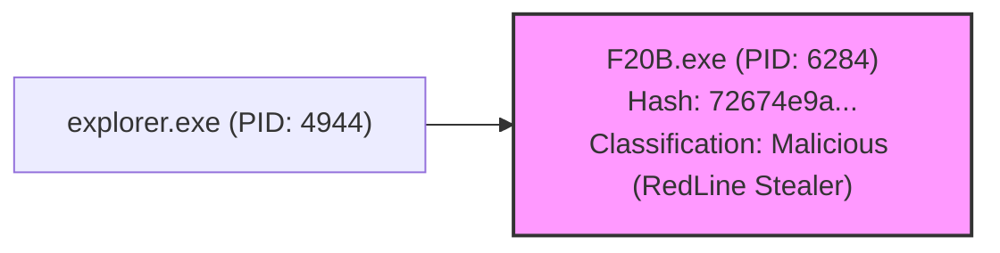
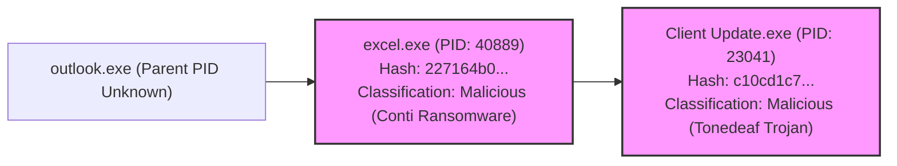
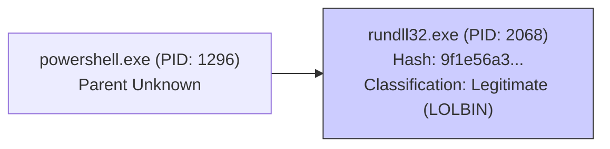

# Case Event Timeline & Process Analysis Report: Case 2160

**Runbook Used:** Case Event Timeline & Process Analysis Workflow
**Timestamp:** 2025-05-03 19:12 (UTC-4)
**Case ID:** 2160

## 1. Case Summary

*   **Case Name:** Rundll32 execute long filename.
*   **Priority:** PriorityHigh
*   **Status:** Opened
*   **Assignee:** @Tier1
*   **Initial Alert Trigger:** Alert ID 14379 (RUNDLL32 EXECUTE LONG FILENAME.) triggered by rule `ur_0bdc26ec-1a7b-4d60-972d-721d33ded7f4`.
*   **Associated Alerts:** 9 alerts in total, including multiple ATI High Priority Rule Matches for File IOCs and a Google Safebrowsing detection.

## 2. Process Execution Trees

### Tree 1 (Host: oscar.wild.desktop)



### Tree 2 (Host: mikeross-pc)



### Tree 3 (Host: WINS-D19)



## 3. Event Timeline Table

| Timestamp (UTC)         | Delta     | Host                | Principal Process (PID)                               | Target Process (PID)                                  | Classification        | Notes                                                                 | Potential Tactic(s) |
| :---------------------- | :-------- | :------------------ | :---------------------------------------------------- | :---------------------------------------------------- | :-------------------- | :-------------------------------------------------------------------- | :------------------ |
| 2025-04-28T07:40:30Z    | -         | oscar.wild.desktop  | explorer.exe (4944)                                   | F20B.exe (6284)                                       | **Malicious** (RedLine) | Process Launch (Alert 14920)                                          | Execution (T1204)   |
| 2025-04-28T08:46:05Z    | +1h 5m 35s| mikeross-pc         | outlook.exe (?)                                       | excel.exe (40889)                                     | **Malicious** (Conti) | Process Launch (Parent of PID 40889)                                | Execution (T1204)   |
| 2025-04-28T08:46:46Z    | +41s      | mikeross-pc         | excel.exe (40889)                                     | Client Update.exe (23041)                             | **Malicious** (Tonedeaf)| Process Launch (Alert 14420, 14417)                               | Execution (T1204)   |
| 2025-04-28T08:48:00Z    | +1m 14s   | mikeross-pc         | Client Update.exe (23041)                             | -                                                     | **Malicious** (Tonedeaf)| File Open: Chrome Login Data (Alert 14418)                            | Credential Access (T1555.003) |
| 2025-04-28T08:48:00Z    | +0s       | mikeross-pc         | Client Update.exe (23041)                             | -                                                     | **Malicious** (Tonedeaf)| Network DNS: MANYGOODNEWS.COM (Alert 14418)                         | C2 (T1071)          |
| 2025-04-28T08:48:00Z    | +0s       | mikeross-pc         | excel.exe (40889)                                     | -                                                     | **Malicious** (Conti) | Network HTTP: POST to MANYGOODNEWS.COM/dow/Client Update.exe (Alert 14417) | C2 (T1071)          |
| 2025-04-28T08:48:00Z    | +0s       | mikeross-pc         | excel.exe (40889)                                     | -                                                     | **Malicious** (Conti) | File Open: survey.xls (Alert 14417)                                   | Execution (T1204)   |
| 2025-04-28T08:48:00Z    | +0s       | mikeross-pc         | -                                                     | Client Update.exe (File Creation)                     | **Malicious** (Tonedeaf)| File Creation (Alert 14420)                                         | Persistence?        |
| 2025-04-28T08:48:00Z    | +0s       | mikeross-pc         | -                                                     | excel.exe (File Hash Match)                           | **Malicious** (Conti) | ATI File IOC Match (Alert 14421, 14416)                             | -                   |
| 2025-04-28T08:48:00Z    | +0s       | mikeross-pc         | -                                                     | Client Update.exe (File Hash Match)                   | **Malicious** (Tonedeaf)| ATI File IOC Match (Alert 14420, 14415)                             | -                   |
| 2025-04-28T08:48:00Z    | +0s       | mikeross-pc         | Client Update.exe (Process Hash Match)                | -                                                     | **Malicious** (Tonedeaf)| ATI File IOC Match (Alert 14418, 14417)                             | -                   |
| 2025-04-28T08:48:00Z    | +0s       | mikeross-pc         | excel.exe (Process Hash Match)                        | -                                                     | **Malicious** (Conti) | ATI File IOC Match (Alert 14416, 14415)                             | -                   |
| 2025-04-28T08:48:00Z    | +0s       | -                   | Chat Attachment (File Hash Match)                     | -                                                     | **Malicious** (Amadey)  | ATI File IOC Match (Alert 14419)                                    | -                   |
| 2025-04-28T10:01:30Z    | +1h 13m 30s| WINS-D19            | powershell.exe (1296)                                 | rundll32.exe (2068)                                   | Legitimate (LOLBIN)   | Process Launch (Alert 14379)                                          | Defense Evasion (T1218.011) |

## 4. Analysis & Conclusion

This case involves multiple distinct malware infections across three hosts:

1.  **oscar.wild.desktop:** Infected with RedLine Stealer (`F20B.exe`), likely launched via `explorer.exe`.
2.  **mikeross-pc:** Infected via an Excel file (`survey.xls`) opened from Outlook. This Excel process (`excel.exe`, identified as Conti Ransomware) launched `Client Update.exe` (identified as Tonedeaf Trojan). This Tonedeaf Trojan accessed Chrome credential data and communicated with the C2 domain `MANYGOODNEWS.COM`.
3.  **WINS-D19:** A PowerShell script launched `rundll32.exe`, a common LOLBIN technique for defense evasion. The origin of the PowerShell script could not be determined from the available logs.

The presence of multiple high-severity malware families (RedLine, Conti, Tonedeaf, Amadey, Smokeloader associated with hashes) across different hosts indicates a potentially widespread and serious compromise. The use of `Client Update.exe` to access credentials and communicate with a C2 is particularly concerning.

**Recommendation:** Immediate escalation to Incident Response (IR) team is required. Containment actions (endpoint isolation, network IOC blocking) should be initiated for all affected hosts (`oscar.wild.desktop`, `mikeross-pc`, `WINS-D19`) and the domain `MANYGOODNEWS.COM`. Further investigation is needed to determine the full scope, initial access vectors for each host, and potential data exfiltration.

## 5. Workflow Diagram

```mermaid
sequenceDiagram
    participant User
    participant Cline as Cline (MCP Client)
    participant SOAR as secops-soar
    participant SIEM as secops-mcp
    participant GTI as gti-mcp

    User->>Cline: Generate timeline for Case 2160 with full process tree

    %% Step 1: Get Initial Case Details & Alerts
    Cline->>SOAR: get_case_full_details(case_id=2160)
    SOAR-->>Cline: Case Details, List of Alerts (14920, 14421, 14420, 14419, 14418, 14417, 14416, 14415, 14379)

    %% Step 2 & 3: Get Events & Optional Rule/Detection Details
    loop For each Alert Ai
        Cline->>SOAR: list_events_by_alert(case_id=2160, alert_id=Ai)
        SOAR-->>Cline: Events for Alert Ai
        Note over Cline: Extract Process Info, Assets, Hashes
        %% Optional Rule/Detection lookups skipped in this run
    end

    %% Step 5: Find Parent Processes
    Cline->>SIEM: search_security_events(text="PROCESS_LAUNCH for target PID 23041 on mikeross-pc")
    SIEM-->>Cline: Launch Event (Parent: excel.exe 40889)
    Cline->>SIEM: search_security_events(text="PROCESS_LAUNCH for target PID 40889 on mikeross-pc")
    SIEM-->>Cline: Launch Event (Parent: outlook.exe)
    Cline->>SIEM: search_security_events(text="PROCESS_LAUNCH for target PID 1296 on WINS-D19")
    SIEM-->>Cline: No Results
    Cline->>SOAR: google_chronicle_list_events(target=WINS-D19, event_type=PROCESS_LAUNCH, time=...)
    SOAR-->>Cline: No Results

    %% Step 7: Enrich Process Hashes
    loop For each Hash Hi
        Cline->>GTI: get_file_report(hash=Hi)
        GTI-->>Cline: GTI Report for Hash Hi -> Classify Process
    end

    %% Step 10: Optional Gemini Summary (Skipped)
    %% Cline->>SOAR: siemplify_create_gemini_case_summary(case_id=2160)
    %% SOAR-->>Cline: No Response

    %% Step 12: Confirm Report Generation Preferences
    Cline->>User: ask_followup_question(question="Include time delta?")
    User->>Cline: Confirmation ("Yes")

    %% Step 13: Write MD Report
    Note over Cline: Format report content (incl. Trees, Table with delta)
    Cline->>Cline: write_to_file(path="./reports/case_2160_timeline_...", content=...)
    Note over Cline: MD Report file created.
