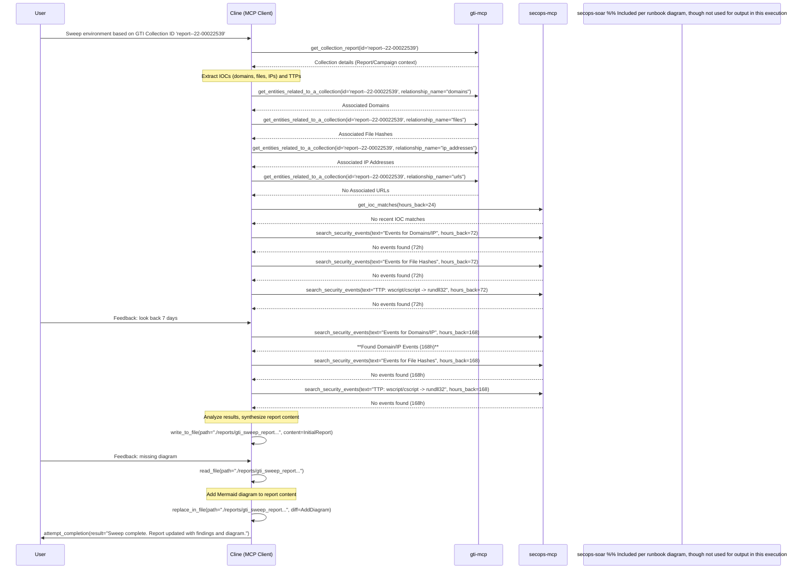

# Environment Sweep Report: GTI Collection report--22-00022539

**Runbook Used:** .clinerules/run_books/compare_gti_collection_to_iocs_and_events.md
**Timestamp:** 2025-05-03 20:20 America/New_York
**GTI Collection ID:** report--22-00022539

## 1. GTI Collection Context

The report `report--22-00022539` details campaigns distributing URSNIF IAP 2.0 malware via phishing emails containing Google Drive links to password-protected ZIP files. These ZIPs contain ISO files, which in turn hold LNK files, batch scripts, JavaScript, and the URSNIF payload. The execution chain involves the LNK file triggering the batch script, which runs the JavaScript, ultimately launching the URSNIF DLL via `rundll32.exe`.

## 2. Associated IOCs (from GTI)

*   **Domains:** `unpeoritas.art`, `superstarts.top`, `internetcoca.in`, `superlist.top`, `asiorpatms.com`
*   **IP Address:** `193.106.191.163`
*   **File Hashes (SHA256):**
    *   `e780f0cf56e479a41a8c47a5431629712b14fc2c0733995d25131df176c95cde`
    *   `d13ef35d0154605030c49f73b34c50b6b0ef1ca4d78aea01b16ec80c2b5b61a0`
    *   `068bbccd3ca16a9ce38f7d31f2bdf82d3a7941150f61b3f9b575cdf5668390fc`
    *   `b7f52dcc8a79cc017c9c9f79195e1703244a316cd457b9a9e7ebfe3635cfebc2`
    *   `d3c93b8c458cd226de3654887dff3581e7daa531309bd4cfea89432bcaccfddd`
    *   `2cbd302d6d0ee84f1dff02e7f06ff8aee0b4998ac9e8223a9194b2caa399876f`
    *   `58d152fe68af114aafbba9a2b030b8ceaadef66058097d3abdebf23649161086`
    *   `63ea92a7bb4fe8b1e8150c914a3633ab33d569febbc86226e4a042c25a53681d`
    *   `6c38a701781477bdbbf61856eba53b743464025434431c5d74fdc378f9f00b2e`
    *   `d078131d87426713e4e6f8641fb80dce9ab94096f1fd76df444d8c195f218859`
*   **URLs:** None

## 3. SIEM Findings (Last 168 Hours / 7 Days)

*   **IOC Matches:** No recent IOC matches found via integrated threat feeds (checked last 24h).
*   **Domain/IP Events:** **Activity Found!**
    *   Multiple `NETWORK_DNS` events observed for domains `superlist.top`, `superstarts.top`, and `internetcoca.in` around 2025-04-27 and 2025-04-30.
    *   Multiple `NETWORK_CONNECTION` events observed to IP `193.106.191.163` (port 80) around the same timeframe.
    *   **Source Host:** `malwaretest-win` / `malwareTest-win10`
    *   **Source Process:** `\Device\CdRom1\me\123.com` (SHA256: `7d99c80a1249a1ec9af0f3047c855778b06ea57e11943a271071985afe09e6c2`, MD5: `d0432468fa4b7f66166c430e1334dbda`), identifying as `RUNDLL32.EXE`.
    *   **Parent Process:** `wscript.exe` (PID 6212) with command line `"C:\Windows\System32\WScript.exe" "E:\me\canWell.js" hello cexe lldnur revreSretsigeRllD`.
*   **File Hash Events:** No events found involving the specific file hashes listed in the GTI report's relationships.
*   **TTP Search:** No events found matching the specific TTP pattern of `wscript.exe` or `cscript.exe` launching `rundll32.exe` (Note: The observed parent *was* `wscript.exe`, but the search might have been too specific or missed due to log timing/details).

## 4. Conclusion & Recommendations

The environment sweep based on GTI Collection `report--22-00022539` using a 7-day lookback **found activity matching the C2 infrastructure and TTPs** described in the report on host `malwaretest-win` / `malwareTest-win10` around 2025-04-27 and 2025-04-30.

**Recommendations:**
*   **Investigate Host:** Initiate an incident response investigation for host `malwaretest-win` / `malwareTest-win10` focusing on the activity timeframe (around 2025-04-27 to 2025-04-30).
*   **Containment:** Consider isolating the host `malwaretest-win` / `malwareTest-win10` pending investigation. Block the identified C2 domains (`superlist.top`, `superstarts.top`, `internetcoca.in`) and IP (`193.106.191.163`) at the network perimeter.
*   **Review Detections:** While specific file hashes weren't seen, the C2 activity was logged. Review existing detection rules for URSNIF C2 communication and the observed execution chain (`wscript.exe` -> `rundll32.exe` from unusual path) to ensure they are effective or tune/create as needed.

## 5. Workflow Diagram

