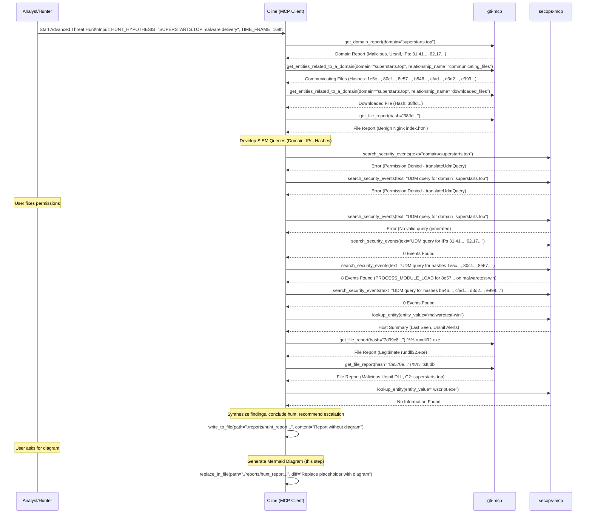

# Advanced Threat Hunt Report: SUPERSTARTS.TOP

**Runbook Used:** `.clinerules/run_books/advanced_threat_hunting.md`
**Timestamp:** 2025-05-03 14:21 (America/New_York)
**Hypothesis:** Malicious domain SUPERSTARTS.TOP is being used to deliver malware.

## Summary of Findings

1.  **Domain Analysis (`superstarts.top`):**
    *   Confirmed malicious by GTI (Reputation -57, Mandiant Score 92).
    *   Associated with Ursnif/Gozi malware collections.
    *   Known associated IPs: `31.41.44.27`, `62.173.149.9`.
    *   GTI identified several communicating files and one downloaded file (benign Nginx index.html).

2.  **Malicious File Analysis (`itsIt.db`):**
    *   SHA256: `8e570e32acb99abfd0daf62cff13a09eb694ebfa633a365d224aefc6449f97de`
    *   Identified by GTI as communicating with `superstarts.top`.
    *   Confirmed malicious by GTI (Ursnif/Gozi, High Severity).
    *   GTI malware config lists `superstarts.top`, `superlist.top`, `internetcoca.in`, and `193.106.191.163` as C2.

3.  **SIEM Analysis (Last 7 Days):**
    *   **Network:** No direct network events (connections, DNS) found for `superstarts.top` or its associated IPs (`31.41.44.27`, `62.173.149.9`).
    *   **File/Process:**
        *   The malicious DLL (`8e570e...`) was observed being loaded (`PROCESS_MODULE_LOAD`) on host `malwaretest-win`.
        *   Loading Process: `rundll32.exe` (SHA256: `7d99c8...`, legitimate Windows binary).
        *   Parent Process: `wscript.exe`.
        *   Event Timestamps: April 27th & 30th, 2025 (Note: Logs may be replayed).
        *   No SIEM events found for other associated file hashes.

4.  **Host Context (`malwaretest-win`):**
    *   Last seen: April 30th, 2025.
    *   Associated SIEM Alerts: `ursnif_malware_dns`, `ATI Active Breach Rule Match for File IoCs`.

## Conclusion & Recommendation

The hunt confirmed malicious activity related to the target domain (`superstarts.top`) and associated malware (Ursnif/Gozi) on the host `malwaretest-win`, specifically the loading of a malicious DLL (`8e570e...`) configured to use the domain for C2.

**Escalation for incident response is recommended**, focusing on host `malwaretest-win`. Further investigation should include endpoint analysis and potentially triggering the Malware Incident Response runbook.

## Workflow Diagram

