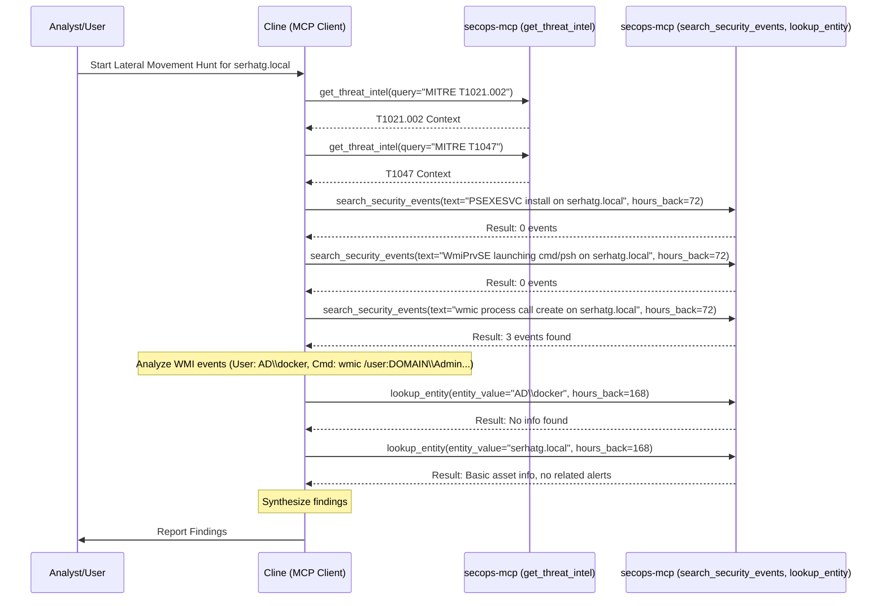

# Lateral Movement Hunt Report: PsExec/WMI for serhatg.local

**Runbook Used:** `.clinerules/run_books/lateral_movement_hunt_psexec_wmi.md`
**Timestamp:** 2025-05-04 00:32 AM UTC-4
**Target Host:** `serhatg.local`
**Timeframe:** Last 72 hours (approx. 2025-05-01 00:32 to 2025-05-04 00:32 UTC-4)

## Hunt Objective

Proactively hunt for signs of lateral movement involving the host `serhatg.local` using common administrative tools like PsExec or WMI abuse.

## Techniques Investigated

*   **T1021.002:** Remote Services: SMB/Windows Admin Shares (Context for PsExec)
*   **T1047:** Windows Management Instrumentation (WMI)

## Workflow Performed

## Findings

1.  **PsExec:** No evidence of PsExec service (`PSEXESVC.exe`) installation was found on `serhatg.local`.
2.  **WMI (Suspicious Process Launch):** No evidence of `WmiPrvSE.exe` launching `cmd.exe` or `powershell.exe` was found on `serhatg.local`.
3.  **WMI (Remote Process Creation via `wmic`):**
    *   **Events Found:** 3 `PROCESS_LAUNCH` events were identified matching this pattern.
    *   **Details:**
        *   **Timestamps:** 2025-05-01 15:27:53 UTC, 2025-05-02 15:27:53 UTC, 2025-05-03 15:27:53 UTC (Daily).
        *   **Host:** `serhatg.local`
        *   **User:** `AD\docker`
        *   **Parent Process:** `powershell.exe` (PID 19300)
        *   **Command:** `cmd.exe /c "wmic /user:DOMAIN\Administrator /password:P@ssw0rd1 /node:"127.0.0.1" process call create notepad.exe"`
    *   **Analysis:** This indicates a daily scheduled task run by `AD\docker` using PowerShell, which then uses `wmic` with hardcoded administrator credentials to launch `notepad.exe` locally via WMI.
4.  **Entity Enrichment:**
    *   `AD\docker`: No context found in SIEM.
    *   `serhatg.local`: Basic asset info found, no related alerts in the entity summary.

## Conclusion

No direct lateral movement *between* hosts using PsExec or WMI was identified targeting `serhatg.local`. However, the hunt uncovered a daily scheduled task using WMI (T1047) with hardcoded administrator credentials, representing a security risk due to credential exposure.

## Recommendations

1.  Investigate the purpose of the scheduled task running as `AD\docker` on `serhatg.local`.
2.  If the task is legitimate, modify the script to use secure credential handling methods (e.g., service accounts, managed identities, credential vaults) instead of hardcoded passwords in the command line.
3.  If the task or the `AD\docker` user is unauthorized or unnecessary, take appropriate remediation steps (e.g., disable task, disable user).
